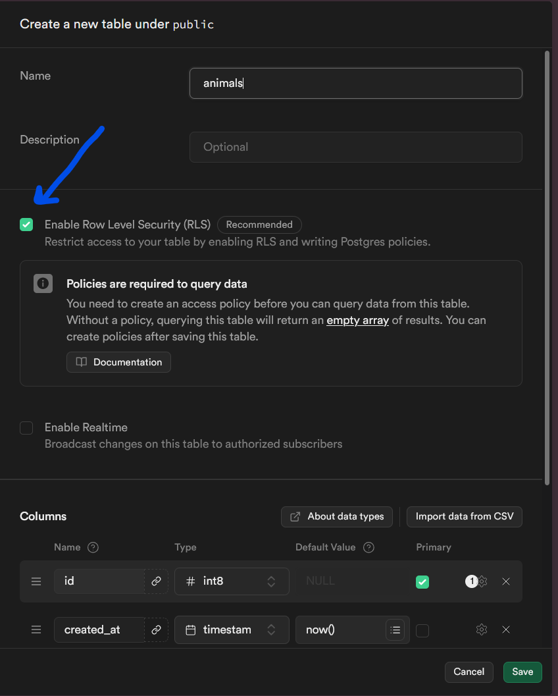

# รวมสิ่งที่แก้ไข(s)

1. เปลี่ยนจาก Hard-coded เป็นการใช้ Environment Variables

   ```js
   const supabaseUrl = 'https://xxxx.supabase.co'
   const supabaseKey = 'xxxxxxxxxxxxxxxxxxxxxxxx'
   ```

   เปลี่ยนเป็น

   ```js
   const supabaseUrl = process.env.SUPABASE_URL
   const supabaseKey = process.env.SUPABASE_KEY
   ```

   > **วิธีใช้ให้?**: copy ไฟล์ `.env.example` เป็น `.env` และกรอกค่าให้ถูกต้อง
   > จากนั่นจึงรัน `npm run ...` ได้ปกติ
   >
   > **ทำไม?**: ได้ประโยชน์ 2 เรื่องคือ เวลาแก้จะได้แก้ที่เดียวในไฟล์เดียว (`.env`) และไม่จำเป็นต้องเอาขึ้น Github กันข้อมูลรั่วไหล (แต่ในกรณ๊นี้ไม่สำคัญเพราะว่ายังไง `supabaseKey` ก็อยู่ในมือถือคนใช้งานอยู่ดี)

2. ตอนสร้าง Database Table ให้สังเกตเรื่อง RLS (สำคัญมาก)

   

   **มันทำหน้าที่อะไร?** RLS หรือ Row Level Security ทำหน้าที่กำหนดสิทธิ์การเข้าถึงข้อมูลใน Database ว่าใครสามารถทำอะไรได้บ้าง (อ่าน/เขียน/อัพเดท/ลบ) กับข้อมูลแบบไหนบ้าง (ของตัวเอง/ของคนอื่น/หรือคนที่ไม่ได้ Login ก็ตั้งได้)

      - **ถ้าไม่เอา RLS**: ทุกคนจะสามารถ อ่าน/เขียน/อัพเดท/ลบ ข้อมูลได้
      - **ถ้าเอา RLS**: จนกว่าจะตั้งสิทธิ์ให้ถูกต้อง จะไม่สามารถเข้าถึงข้อมูลได้เลย

    ซึ่งตอนนี้เราจะลองสร้างแบบ **ไม่มี RLS ก่อน**

    
