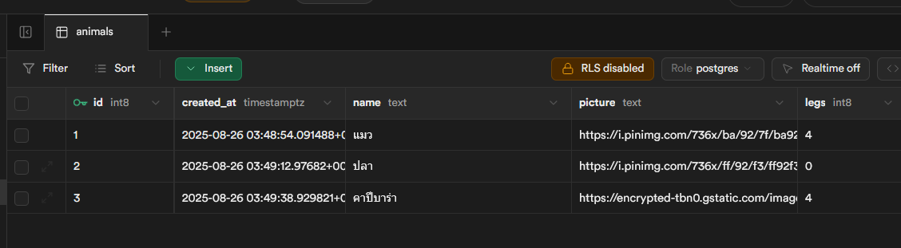
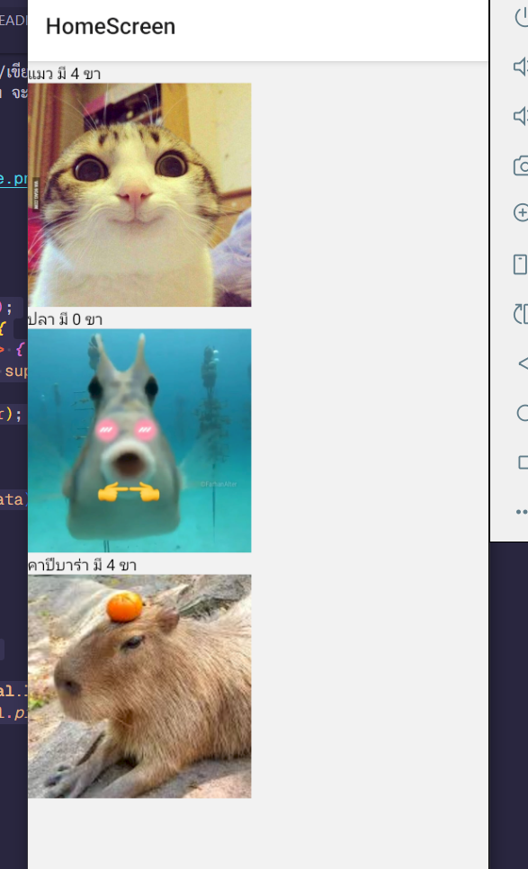

# รวมสิ่งที่แก้ไข(s)

1. เปลี่ยนจาก Hard-coded เป็นการใช้ Environment Variables ([supabaseClient.js](myapp/supabaseClient.js), [.env.example](myapp/.env.example))

   ```js
   const supabaseUrl = 'https://xxxx.supabase.co'
   const supabaseKey = 'xxxxxxxxxxxxxxxxxxxxxxxx'
   ```

   เปลี่ยนเป็น

   ```js
   const supabaseUrl = process.env.SUPABASE_URL
   const supabaseKey = process.env.SUPABASE_KEY
   ```

   > **วิธีใช้ให้?**: copy ไฟล์ `.env.example` เป็น `.env` และกรอกค่าให้ถูกต้อง
   > จากนั่นจึงรัน `npm run ...` ได้ปกติ
   >
   > **ทำไม?**: ได้ประโยชน์ 2 เรื่องคือ เวลาแก้จะได้แก้ที่เดียวในไฟล์เดียว (`.env`) และไม่จำเป็นต้องเอาขึ้น Github กันข้อมูลรั่วไหล (แต่ในกรณ๊นี้ไม่สำคัญเพราะว่ายังไง `supabaseKey` ก็อยู่ในมือถือคนใช้งานอยู่ดี)

2. ตอนสร้าง Database Table ให้สังเกตเรื่อง RLS (สำคัญมาก)

   

   **มันทำหน้าที่อะไร?** RLS หรือ Row Level Security ทำหน้าที่กำหนดสิทธิ์การเข้าถึงข้อมูลใน Database ว่าใครสามารถทำอะไรได้บ้าง (อ่าน/เขียน/อัพเดท/ลบ) กับข้อมูลแบบไหนบ้าง (ของตัวเอง/ของคนอื่น/หรือคนที่ไม่ได้ Login ก็ตั้งได้)

      - **ถ้าไม่เอา RLS**: ทุกคนจะสามารถ อ่าน/เขียน/อัพเดท/ลบ ข้อมูลได้
      - **ถ้าเอา RLS**: จนกว่าจะตั้งสิทธิ์ให้ถูกต้อง จะไม่สามารถเข้าถึงข้อมูลได้เลย

    ซึ่งตอนนี้เราจะลองสร้างแบบ **ไม่มี RLS ก่อน**

    | ตัวอย่างตาราง                               | ตัวอย่างข้อมูล                               |
    | ----------------------------------------- | ---------------------------------------- |
    |  |  |

    ทดสอบดึงข้อมูล ([HomeScreen.js](myapp/HomeScreen.js))

    ```jsx
    function AnimalsList() {
      const [data, setData] = useState();
      useFocusEffect(useCallback(() => {
        const fetchAnimals = async () => {
          const { data, error } = await supabase.from('animals').select()
          if (error) {
            console.error('Error', error);
            return;
          }

          console.log('Animals data', data);
          setData(data)
        }
        fetchAnimals()
      }, []));

      return <View>
        {(data || []).map((animal) => (
          <View key={animal.id}>
            <Text>{animal.name} มี {animal.legs} ขา</Text>
            <Image source={{ uri: animal.picture }} style={{ width: 200, height: 200 }} />
          </View>
        ))}
      </View>
    }
    ```

    
